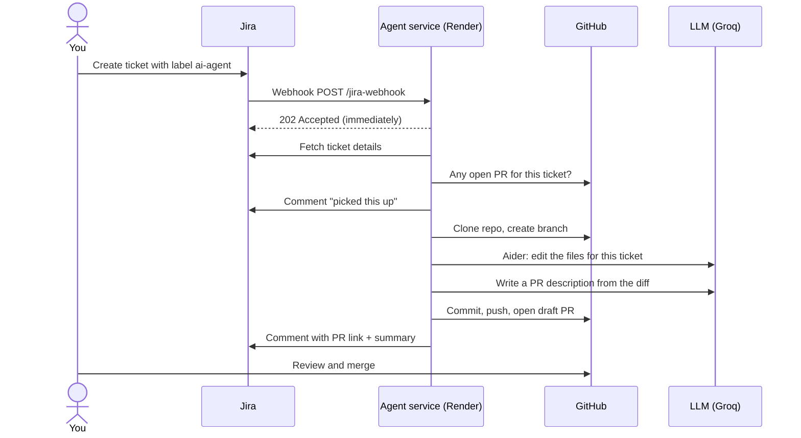

# How it works

What happens between creating a Jira ticket and a pull request appearing on GitHub: each step, the code that does it, and why it's built that way.

## The big picture



A typical run takes about a minute (CA-2 took ~50 seconds), plus 30–60 seconds if the Render service was asleep.

There are three parts:

| Part | Where | Role |
|---|---|---|
| **Jira webhook** | Jira ⚙ → System → WebHooks | Tells the agent when a ticket is created or updated in project CA with the `ai-agent` label |
| **Agent service** | Render (Docker), code in `app/` | Receives the webhook, runs the job, talks to Jira, GitHub and the LLM |
| **Aider + LLM** | Inside the agent's container; Groq's API | Aider reads the repo and applies edits; the LLM decides what the edits are |

---

## Part 1: Receiving the webhook (`app/main.py`)

This part must be fast: Jira waits for the reply and retries if it's slow. So it only checks and queues; the real work happens later.

### Step 1: Jira sends the event
When a ticket in project CA with label `ai-agent` is created or updated, Jira POSTs a JSON payload to `https://<render-url>/jira-webhook`. The payload includes the event type (`jira:issue_created` / `jira:issue_updated`), the ticket key and fields, and for updates a `changelog` of what changed.

### Step 2: Check the request really came from Jira
`_verify()` rejects anything that doesn't prove it knows `WEBHOOK_SECRET`, with **401**. Two methods are accepted:
- **Signature (preferred):** Jira signs the body with the secret and sends `X-Hub-Signature: sha256=<hmac>`. The agent recomputes the HMAC and compares in constant time.
- **URL token (fallback):** `?token=<secret>`, for Jira setups without a Secret field.

*Why:* the URL is public. Without this, anyone could make the agent open PRs on your repo.

### Step 3: Decide whether this event should trigger a run
The request is acknowledged but ignored (`"accepted": false`) when:
- the payload has no ticket,
- the ticket doesn't carry the `ai-agent` label,
- `_is_trigger()` says no: only **ticket created**, or **ticket updated where the changelog shows `ai-agent` was just added**, count.

*Why the last rule:* Jira also sends `issue_updated` for comments. The agent writes comments, so reacting to every update would make it trigger itself in a loop.

### Step 4: Save the ticket to the queue and queue the job
- The agent adds the label **`ai-agent-queued`** to the ticket (`_set_queue_label`). This is the queue's persistent copy: it lives in Jira, so it survives a Render restart (see [Surviving a restart](#surviving-a-restart)). It's removed when the job ends.
- `_in_flight` holds the ticket keys that are queued or running. If the key is already there, the event is ignored (Jira sometimes sends the same event twice).
- The job is submitted to a **single-worker thread pool**, so only one ticket is processed at a time. The free Render instance has 512 MB RAM and Groq's free tier is rate-limited, so running jobs in parallel would cause failures.
- The endpoint replies **202 Accepted** straight away.

Adding the queue label (and moving the ticket's status later) makes Jira send more `issue_updated` webhooks. They're ignored by the Step 3 rule, because they don't newly add `ai-agent`.

---

## Part 2: The job (`app/agent.py`, `CodingAgent._handle`)

Runs in the background thread, one ticket at a time.

### Step 5: Fetch the ticket from Jira
`JiraClient.get_issue()` calls Jira's REST API v2 for the summary, description, labels and issue type. API v2 is used because it returns the description as plain text (v3 returns a complex JSON document format).

The label is checked again here, in case it was removed between the webhook and the job starting.

### Step 6: Skip if the ticket already has an open PR
`GitHubClient.find_open_pr_for_issue()` looks through open PRs for a branch named `ai/<KEY>` or `ai/<KEY>-...`. If one exists, the agent comments *"Skipped: a pull request for this ticket is already open"* with the link, and stops.

*Why match by key, not full branch name:* the branch name includes the ticket title. Matching by key means renaming a ticket can't produce a second PR.

### Step 7: Tell the ticket it's being worked on
Jira comment: **🤖 Coding agent picked this up. Working on branch `ai/CA-2-replace-deprecated-dash-imports`...**

The branch name is `ai/` + ticket key + the title turned into a short slug (`branch_name()`).

The ticket is moved to **In Progress** (`JIRA_STATUS_IN_PROGRESS`). Status moves are best-effort: if the workflow has no such status, a warning is logged with the statuses that exist, and the job carries on.

### Step 8: Prepare a fresh copy of the repo
1. Ask GitHub for the repo's default branch (e.g. `main`).
2. `git clone --depth 50` into `/tmp/jira-agent/<KEY>`, authenticating with `GITHUB_TOKEN` in the clone URL. A shallow clone is faster and uses less disk.
3. Set the commit author to `jira-coding-agent` (a GitHub noreply address), so nobody's personal email ends up in commits.
4. Create the branch `ai/<KEY>-<slug>`.
5. Add `.aider*` to `.git/info/exclude`, so Aider's cache files never get committed. The repo's own `.gitignore` isn't touched.

Every job starts from a clean clone, so one ticket's leftovers can't leak into the next.

### Step 9: Remember which files use Windows line endings
`crlf_files()` records files committed with CRLF line endings. Language models write Unix (LF) endings, and without this step a one-line fix shows up on GitHub as the whole file changing.

### Step 10: Pick the files to give Aider
`mentioned_files()` looks for repo files whose path or file name appears in the ticket's summary or description (e.g. `Crimes in India Dashboard.py`), skipping files over 200 KB such as large CSVs.

*Why:* Aider only edits files that have been "added to the chat". Left alone, it didn't reliably add files whose names contain spaces, so the model asked for the file and then gave up. If the ticket names no file, Aider falls back to its **repo map** (a summary of the codebase) to find the right place.

### Step 11: Run Aider
`_run_aider()` runs the `aider` command-line tool once, non-interactively. It sends the model a prompt (`build_task_prompt()`) containing the ticket key, type, title and description, and asks for *"the smallest correct change… follow the existing code style… do not change unrelated code."*

Key options:

| Option | Why |
|---|---|
| `--model groq/openai/gpt-oss-120b` | The free LLM (set by `AIDER_MODEL`) |
| `--edit-format diff` | The model returns search/replace blocks, so it only touches the lines it changes. The alternative, `whole`, rewrites entire files and caused unrequested reformatting. |
| `--yes-always` | No human is there to answer Aider's questions (e.g. "add this file?") |
| `--no-suggest-shell-commands` | Otherwise `--yes-always` would auto-run commands the model suggests, such as starting the dashboard server |
| `--no-auto-commits`, `--no-dirty-commits` | The agent makes the commit itself, with a proper message |
| `--no-gitignore` | Don't modify the repo's `.gitignore` |
| `--no-check-update`, `--analytics-disable`, `--no-pretty`, `--no-stream` | Quiet, plain-text output suitable for logs |
| `--chat-history-file`, `--input-history-file` | Written to a temp folder outside the repo, deleted afterwards |

The run has a **15-minute timeout** (`AIDER_TIMEOUT_SECONDS`). Aider's output is kept (with the GitHub token removed) for the PR and for error messages.

### Step 12: Put the original line endings back
`restore_crlf()` converts the files recorded in Step 9 back to CRLF, so the diff shows only real changes.

### Step 13: Check that something actually changed
`git add -A`, then `git status`. If nothing changed, the agent comments **"🤖 Coding agent finished but made no changes"** with the last part of Aider's output (usually the model explaining what it needed), and stops. This mostly happens with vague tickets.

**Then check that the change compiles** (`_check_and_fix()`, `app/checks.py`). Every changed Python file is compiled in memory (no `.pyc` files end up in the commit). If there's a syntax error, Aider gets **one** more attempt with the exact error message (e.g. `line 258: '(' was never closed`), and the files are checked again. The result becomes a **Checks** section in the PR:
- ✅ passed, noting if the agent had to fix its own first attempt
- ❌ failed, with the errors and a "Do not merge" warning; the Jira comment also says *Checks failed*
- ➖ skipped, when no Python files changed

The PR is still opened when checks fail, so the attempt is visible and reviewable, but it's clearly flagged.

### Step 14: Write the PR description
`describe_changes()` in `app/pr_writer.py` sends the ticket and the **actual staged diff** (capped at 12,000 characters) to the same LLM, asking for three Markdown sections:
- **Summary**: the problem and how the PR fixes it
- **Changes**: one bullet per change, naming the file and the reason
- **How to verify**: concrete steps for a reviewer

The prompt tells the model to describe only what the diff does. If the call fails or the reply lacks a `## Summary` section, the agent uses a plain fallback description, so the PR still opens.

### Step 15: Commit
Commit message:
```
CA-2: Replace deprecated Dash imports

<the Summary paragraph from Step 14>

Jira: https://<site>.atlassian.net/browse/CA-2
```

### Step 16: Push the branch
`git push --force` to `ai/<KEY>-<slug>`. Force is used because a closed PR may have left an old branch with the same name. It's safe here because `ai/` branches belong to the agent, and Step 6 already confirmed there's no open PR for this ticket.

### Step 17: Open the pull request
`GitHubClient.create_pr()` opens a PR from the branch into the default branch:
- **Title:** `CA-2: Replace deprecated Dash imports`
- **Body** (`build_pr_body()`): the AI-written description, then a link to the Jira ticket, the list of changed files, and Aider's log in a collapsible section.
- **Draft** when `OPEN_DRAFT_PR=true`, so it can't be merged by accident. GitHub Free only allows drafts on public repos; for a private repo the agent retries as a normal PR.

### Step 18: Report back to Jira
Jira comment: **🤖 Pull request opened: \<link\>**, plus **What changed:** and the summary. The ticket is moved to **In Review** (`JIRA_STATUS_IN_REVIEW`).

### Step 19: Clean up
Whether the job succeeded or failed, the cloned repo and temp files are deleted (`finally:` block), the ticket key is removed from `_in_flight`, and the `ai-agent-queued` label is removed.

---

## Surviving a restart

Render restarts the service on every deploy, and may restart it at other times. Anything held only in memory is lost, so the queue is also kept in Jira:

1. **Accepted:** the ticket gets the `ai-agent-queued` label (Step 4).
2. **Finished** (any outcome): the label is removed (Step 19).
3. **Restarted mid-queue or mid-job:** the label is still there. **2 minutes after startup** (`RECOVERY_DELAY_SECONDS`), `recover_queued()` searches Jira for `labels = "ai-agent-queued"` and queues those tickets again, with event `recovered_after_restart`. The job starts from scratch; a half-done run is safe to repeat (fresh clone, force-pushed agent branch, and the open-PR check in Step 6).

*Why wait 2 minutes:* during a deploy, Render starts the new instance **before** stopping the old one, and gives the old one ~30 seconds to finish. Searching immediately could pick up a ticket the old instance is still working on and run it twice. After 2 minutes, the old job has either finished (label removed) or been stopped (label kept, so it's correctly recovered).

This covers tickets the agent had **received**. A webhook that never arrived (e.g. sent while the service was down) isn't covered: re-add the `ai-agent` label or replay it with `scripts/send_test_webhook.py`.

---

## When something goes wrong

Every step is logged with the job's tag (e.g. `[CA-3#1a2b3c4d]`) and timed; `/jobs` shows each job's status, step timings, tokens and errors. See [observability.md](observability.md).


Any error in Steps 5–18 (bad token, network failure, Aider timeout, Git error) is caught by `handle_issue()`. It:
1. logs the full error in Render's **Logs** tab,
2. comments **🤖 Coding agent failed:** on the ticket with the last part of the error, with the GitHub token removed,
3. moves the ticket back to **To Do** (`JIRA_STATUS_ON_FAILURE`; also used when the agent made no changes),
4. still runs the clean-up.

To retry: fix the cause, then remove and re-add the `ai-agent` label.

## What you see in Jira

| Comment | Status | Label | Meaning |
|---|---|---|---|
| *(none yet)* | unchanged | `ai-agent-queued` added | Accepted, waiting in the queue (Step 4) |
| 🤖 Coding agent picked this up… | **In Progress** | `ai-agent-queued` | Job started (Step 7) |
| 🤖 Pull request opened: … What changed: … | **In Review** | removed | Success (Step 18) |
| 🤖 Coding agent finished but made no changes… | **To Do** | removed | The model didn't edit anything; make the ticket more specific (Step 13) |
| 🤖 Skipped: a pull request for this ticket is already open… | unchanged | removed | Close or merge that PR first (Step 6) |
| 🤖 Coding agent failed: … | **To Do** | removed | Error; see the message and Render logs |

## Where the secrets live and how they're protected

| Secret | Used for | Protection |
|---|---|---|
| `WEBHOOK_SECRET` | Proving webhooks come from Jira | Compared in constant time; never logged |
| `JIRA_API_TOKEN` | Reading tickets, posting comments | Sent only to your Jira site |
| `GITHUB_TOKEN` | Clone, push, PRs | Fine-grained, limited to the target repo; removed from all logs, errors and PR text |
| `GROQ_API_KEY` | LLM calls | Read by Aider/litellm from the environment |

All of them are Render environment variables (and `.env` locally, which is gitignored). None are in the code or the repo.
